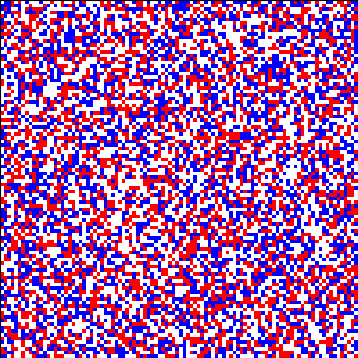

# Biham-Middleton-Levine (BML) Traffic Model Simulation

This is a configurable python simulation of the Biham-Middleton-Levine (BML) traffic model.  

- East-bound (red) cars attempt to move east, if the cell east is free then they will move east, if not possible they will stay in place.  
- South-bound (blue) cars attempt to move south, if the cell south is free then they will move south, if not possible they will stay in place.  

The grid is a torus, meaning that when cars move off the edge at one side, they reappear at the other side.

The goal of this simulation is to observe traffic patterns and visualise how traffic flow depends on car density.

The original paper this model is based on is: Biham, O. et al. (1992) Self Organization and a Dynamical Transition in Traffic Flow Models.  
More about this model can be found [here](https://en.wikipedia.org/wiki/Biham%E2%80%93Middleton%E2%80%93Levine_traffic_model). 

## Features
- Configurable grid size
- Adjustable car density, car direction probability, and amount of simulation steps.
- Export simulation as an animated Gif.
- Track the number of cars at each step of the simulation.

## Dependencies
- NumPy
- MatplotLib
- Pillow

## Examples
Car density at 0.6 which quickly descends into gridlock:  
   

Car density at 0.3 allowing for free flowing traffic:  
 
